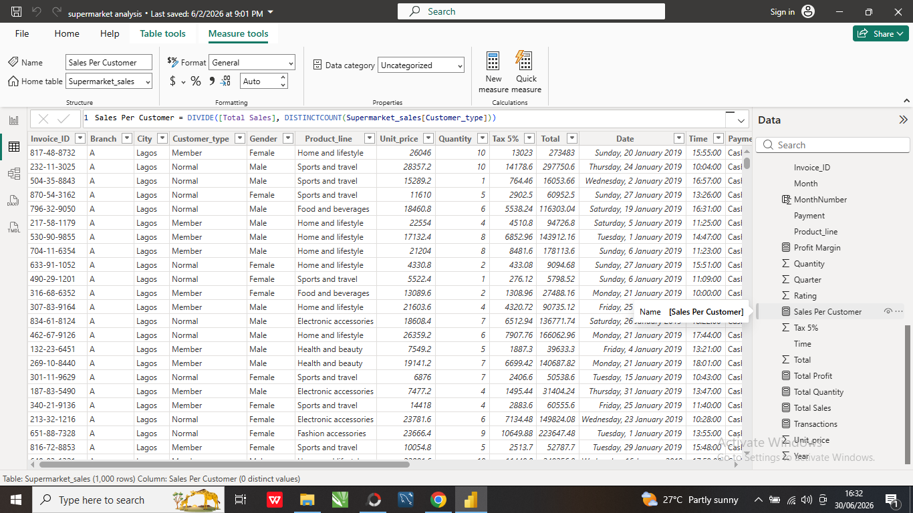
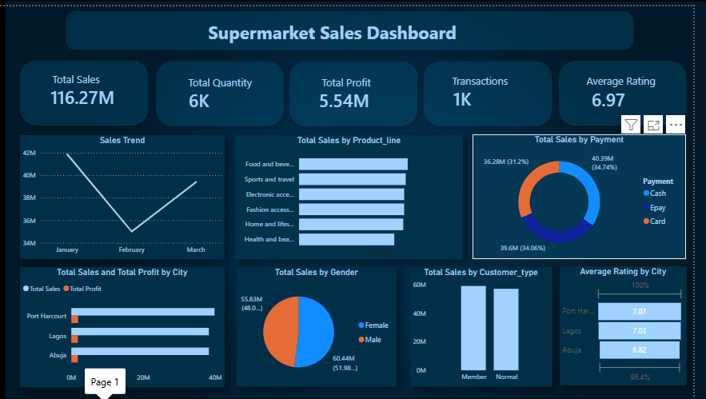
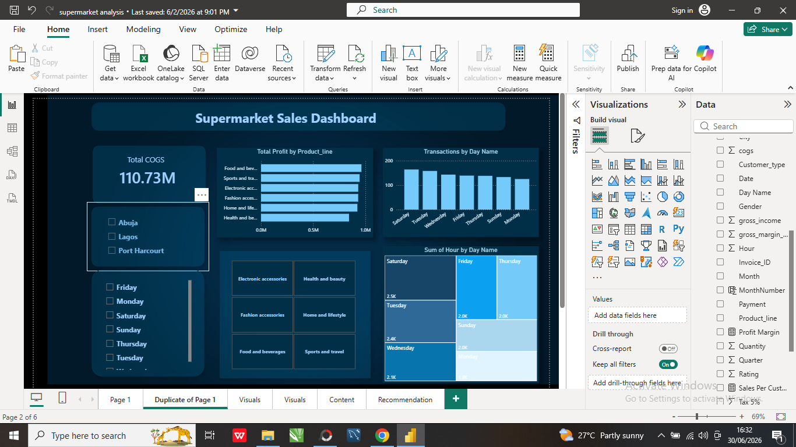

# 🛒 Supermarket Sales Analysis Dashboard

## Project Overview

This project analyzes sales performance for a retail supermarket to uncover trends in revenue, profitability, customer purchasing behavior, payment methods, and product performance. Using Power BI, the dashboard transforms transactional data into actionable insights that support informed business decisions and operational efficiency.

---

## Business Problem

Retail businesses need to understand customer purchasing patterns, product performance, and profitability to make informed decisions. This analysis helps management identify top-performing products, evaluate customer preferences, monitor financial performance, and improve overall business operations.

The project answers the following business questions:

Which product lines generate the highest sales and profit?
Which payment methods are most preferred by customers?
How do customer type and gender influence purchasing behavior?
What are the overall sales and profit trends?
How can business performance be improved?

---

## Tools Used

- Microsoft Power BI
- Microsoft Excel
- Power Query
- DAX
- Data Cleaning
- Data Visualization

---

## Dataset Preview

## Dataset Overview

The dataset contains transactional sales records, including:

Invoice ID
Customer Type
Gender
Product Line
Unit Price
Quantity
Total Sales
Cost of Goods Sold (COGS)
Gross Income
Gross Margin
Payment Method
Customer Rating
Date
Time

---

---

## Dashboard Preview

## Dashboard Features

Executive KPI Dashboard
Product Line Performance Analysis
Sales Trend Analysis
Customer Segmentation
Payment Method Analysis
Customer Rating Analysis
Interactive slicers for Date and Payment Method
Business Insights & Recommendations page

---

## Key Performance Indicators (KPIs)

| KPI | Value |
|------|-------:|
| Total Sales | 116.27M |
| Total Quantity Sold | 6K |
| Total COGS | 110.73M |
| Total Profit | 5.54M |
| Transactions | 1K |
| Average Customer Rating | 6.97 |

---

# Key Insights

### Sales Performance
- Total sales reached **116.27M** from over **1,000 customer transactions**.
- Sales remained strong throughout the period, with a slight decline in February before recovering in March.

### Product Performance
- Food & Beverages generated the highest sales and profitability.
- Health & Beauty contributed the lowest revenue, indicating opportunities for targeted promotions. & Beauty recorded comparatively lower profit, presenting an opportunity for improvement.

### Customer Analysis
- Member and Normal customers contributed almost equally to total sales.
- Female customers generated slightly higher revenue than male customers.

### Payment Analysis
- Cash remained the most frequently used payment method.
- Card and E-payment options also represented a significant share of customer transactions.
  
### Sales Performance
- The supermarket generated over 116 million in sales while maintaining strong profitability.
- Customer satisfaction remained high with an average rating of 6.97.

---

# Recommendations

- Increase stock levels for top-performing product categories.
- Develop promotional campaigns for lower-performing product lines.
- Strengthen customer loyalty initiatives to increase repeat purchases.
- Encourage digital payment adoption through discounts or rewards.
- Continuously monitor customer feedback to improve shopping experience.
---

# Business Impact

This dashboard enables supermarket managers to:

- Monitor sales performance in real time.
- Identify profitable product categories.
- Understand customer purchasing behavior.
- Improve inventory planning.
- Support strategic decision-making using data.

---

# Skills Demonstrated

- Data Cleaning
- Data Transformation
- Data Modeling
- DAX Calculations
- KPI Development
- Dashboard Design
- Business Intelligence
- Sales Analytics
- Data Storytelling

---

